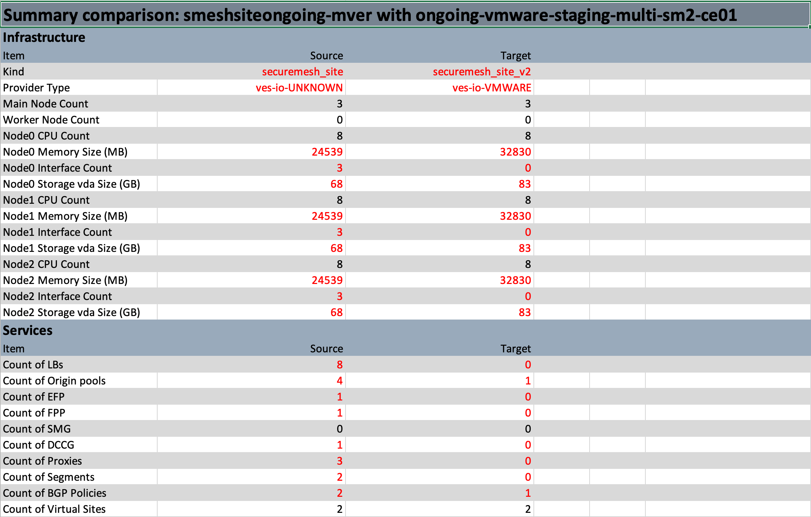
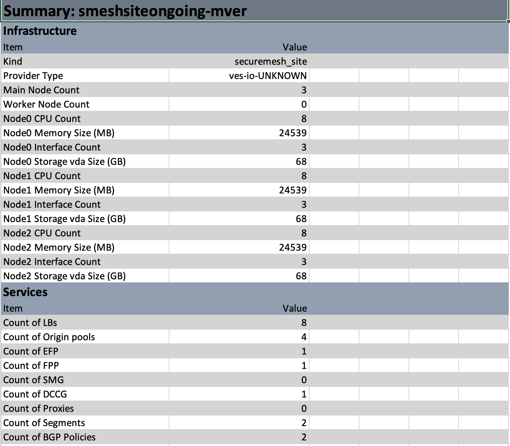

# f5xc-site-query

## Overview

Helper tool `get-sites.py` queries application objects (HTTP / UDP / TCP Load Balancers, Dynamic Proxies and Origin Pools) per namespace
(or all namespaces) and creates a json inventory file with all objects listed per site, virtual site and namespace.

The generated json inventory file helps to answer questions like:

  - a) What application objects are assigned to a site or virtual site and in what namespace
  - b) Who created an application object
  - c) Are there sites that only serve origin pools
  - d) Are there application objects assigned to non-existent sites

### Supported Inventory Data 

This tool supports below inventory data types: 

- Proxy (HTTP Connect & DRP)
- Spokes
- Segment
- BGP Policy
- Origin Pool
- Virtual Site
- Load Balancer
- Node Interfaces
- Site Mesh Group
- DC Cluster Group
- Node Hardware Info
- Forward Proxy Policy
- Enhanced Firewall Policy

Additionally the tool provides list for:

- Sites which are not in `Applied` and `Online` state
  ```json
  {
    "failed": {
      "adarsh-static-vm": "FAILED",
      "adarsh-az-1": "PROVISIONING",
      "ak-tgw2": "APPLY_ERRORED",
      "akash-test-volterra-1": "WAITING_FOR_REGISTRATION",
      "alert-gcp-dntt": "TIMED_OUT",
      "akash-very-big-ce-2": "FAILED",
      "alert-nw-qxin": null,
      "arish-ce": "DESTROY_ERRORED"
    }
  }
  ```
- Untyped sites which do no provide a `kind` key and therefore can not be processed
  ```json
  {
    "untyped": [
      "apisec-stg-ce-k8s-eks",
      "autoscale-qyb-aws-ha-15",
      "autoscale-jop-aws-ha-32",
      "automation-dell-r650-altname-voltmesh"
    ]
  }
  ```

### Tested OS Platforms

| Name    | Status   |
|---------|----------|
| Linux   | tested   |
| Mac OS  | tested   |
| Windows | untested |

## Installation

- Clone repository

```bash
git clone https://github.com/f5devcentral/f5xc-site-query
```

### Docker

Install Docker following instructions:

- Docker Engine: [Docker Engine](https://docs.docker.com/engine/install/)
- Docker Desktop: [Docker Desktop](https://docs.docker.com/desktop/)

On macOS or Linux based systems run below commands to build and run docker container:

- Build image
```bash
docker build . -t site-query:latest
```
- Run container

```bash
docker run -it --rm site-query 
```

### Local

#### Requirements

| Name                                                                              | Version  |
|-----------------------------------------------------------------------------------|----------|
|                                                                                   |          |
| <a name="requirement_python"></a> [python](https://www.python.org/downloads/)     | \>= 3.13 |
| <a name="requirement_git"></a> [git](https://git-scm.com/)                        | \>= 8.0  |
| <a name="requirement_pipx"></a> [pipx](https://pipx.pypa.io/stable/installation/) | latest   |

- Check python version

```bash
python3 --version
--> Python 3.13.1
```

- Install pipx

```bash
python3 -m pip install pipx-in-pipx --user
```

- Install poetry

```bash
pipx install poetry
```

- Install dependencies

```bash
poetry install
eval $(poetry env activate)
#(project) $  # Virtualenv entered
```

## Credentials

The script uses a F5XC API token to access a tenant's configuration. In order to use the tool an API token needs to be generated.

1. Create an API token for our tenant

    Sign in to the F5 XC Console with administrative privileges and navigate to administration. Under 'Personal Management' select 'Credentials'.
    Then click 'Add Credentials' and populate the window. Make sure to select 'API Token' as the 'Credential Type' field. Save the generated API token for the next step.

2. Define environment variables

    Set environment variables with the API URL (replace tenant with your tenant name) and the generated API token.

    ```
    export f5xc_api_url="https://<tenant>.console.ves.volterra.io/api"
    export f5xc_api_token="............................"
    ```

    Alternatively you can set command line options instead when running the script.

## Usage

The tool will only process site objects:

- with state being __APPLIED__
- which can be identified by the __kind__ key

Referencing objects that reference a site object are only added to the site object if the referenced site also exists.

```
usage: get-sites.py [-h] [-a APIURL] [-c] [-f FILE] [-n NAMESPACE] [-q] [-s SITE] [-t TOKEN] [-w WORKERS] [--old-site OLD_SITE] [--new-site NEW_SITE] [--old-site-file OLD_SITE_FILE] [--new-site-file NEW_SITE_FILE] [--build-inventory] [--diff-table]
                    [--diff-file-xlsx DIFF_FILE_XLSX] [--inventory-table] [--inventory-file-xlsx INVENTORY_FILE_XLSX] [--log-level LOG_LEVEL] [--log-stdout] [--log-file]

Get F5 XC Sites command line arguments

options:
  -h, --help            show this help message and exit
  -a, --apiurl APIURL   F5 XC API URL
  -c, --compare         compare new site with old site
  -f, --file FILE       read/write api data to/from json file
  -n, --namespace NAMESPACE
                        namespace (not setting this option will process all namespaces)
  -q, --query           run site query
  -s, --site SITE       site to be processed
  -t, --token TOKEN     F5 XC API Token
  -w, --workers WORKERS
                        maximum number of worker for concurrent processing (default 10)
  --old-site OLD_SITE   old site name to compare with
  --new-site NEW_SITE   new site name to compare with
  --old-site-file OLD_SITE_FILE
                        new site file to compare with
  --new-site-file NEW_SITE_FILE
                        new site file to compare with
  --build-inventory     build inventory and write it to file
  --diff-table          print diff info to stdout
  --diff-file-xlsx DIFF_FILE_XLSX
                        write site diff info to xlsx file
  --inventory-table     print inventory info to stdout
  --inventory-file-xlsx INVENTORY_FILE_XLSX
                        write inventory info to xlsx to file
  --log-level LOG_LEVEL
                        set log level to INFO or DEBUG
  --log-stdout          write log info to stdout
  --log-file            write log info to file
```

### Example to get data from all namespaces:

#### Docker

```bash
docker run -it --rm -v "$(pwd)":/data -e f5xc_api_url=$f5xc_api_url -e f5xc_api_token=$f5xc_api_token site-query -f /data/json/all-ns-prod.json -q --log-stdout
```

#### Executable Call

```bash
./get-sites.py -f ./json/all-ns-prod.json -q --log-stdout
```

### Example to get data from specific namespace:

#### Docker

```bash
docker run -it --rm -v "$(pwd)":/data -e f5xc_api_url=$f5xc_api_url -e f5xc_api_token=$f5xc_api_token site-query -f ./get-sites-specific-ns.json -n default -q --log-stdout
```

#### Executable Call

```bash
./get-sites.py -f ./get-sites-specific-ns.json -n default -q --log-stdout
```

### Example to get data for specific site:

#### Docker

```bash
docker run -it --rm -v "$(pwd)":/data -e f5xc_api_url=$f5xc_api_url -e f5xc_api_token=$f5xc_api_token site-query -f ./get-sites-specific-site.json -q -s f5xc-waap-demo --log-stdout
```

#### Executable Call

```bash
./get-sites.py -f ./get-sites-specific-site.json -q -s f5xc-waap-demo --log-stdout
```

The generated get-sites.json is now populated with application objects per namespace and site/virtual site and can be parsed
e.g. using `gron` or inspected visually.

We can now answer the questions asked in the Overview section above:

a) What application objects are assigned to a site or virtual site and in what namespace

```
{
  "namespaces": [
    "default"
  ],
  "site": {
    "alt-reg-site": {
      "default": {
        "loadbalancer": {
          "f5dc-hello": {
            "uid": "869d61fa-0b21-4482-8d8d-14ca18aa2880",
            "creation_timestamp": "2022-05-10T10:11:18.812992075Z",
            "deletion_timestamp": null,
            "modification_timestamp": "2024-09-12T08:48:52.478785492Z",
            "initializers": null,
            "finalizers": [],
            "tenant": "playground-wtppvaog",
            "creator_class": "prism",
            "creator_id": "m.wiget@f5.com",
            "object_index": 0,
            "owner_view": null,
            "labels": {}
          }
        },
        "origin_pools": {
          "mw-test": {
            "uid": "3c5cb595-a78a-4edf-9c95-9d3dedbeea37",
            "creation_timestamp": "2024-09-14T12:20:25.295967722Z",
            "deletion_timestamp": null,
            "modification_timestamp": null,
            "initializers": null,
            "finalizers": [],
            "tenant": "playground-wtppvaog",
            "creator_class": "prism",
            "creator_id": "m.wiget@f5.com",
            "object_index": 0,
            "owner_view": null,
            "labels": {}
          }
        }
      },
      "site_labels": {}
    },
    . . .
```

The site `alt-reg-site` has a loadbalancer f5dc-hello and origin pool `mw-test` assigned. Empty `site_labels` for this
site `alt-reg-site` indicates the site no longer exists.

b) Who created an application object

To get objects created by a specific creator (F5XC account), use `gron` and `grep`:

```
$ gron get-sites.json | grep wiget
json.site["alt-reg-site"]["default"].loadbalancer["f5dc-hello"].creator_id = "m.wiget@f5.com";
json.site["alt-reg-site"]["default"].origin_pools["mw-test"].creator_id = "m.wiget@f5.com";
json.site["aws-tgw-site"]["default"].loadbalancer["mw-test"].creator_id = "m.wiget@f5.com";
json.site["f5dc-wdc-1-sat-cluster-1"]["default"].origin_pools["f5dc-cluster1-iperf3"].creator_id = "m.wiget@f5.com";
json.site["f5dc-wdc-1-sat-cluster-1"]["default"].origin_pools["f5dc-hello"].creator_id = "m.wiget@f5.com";
json.site["f5dc-wdc-2-sat-cluster-2"]["default"].loadbalancer["f5dc-cluster2-iperf3"].creator_id = "m.wiget@f5.com";
json.site["f5dc-wdc-2-sat-cluster-2"]["default"].loadbalancer["f5dc-hello-cluster2"].creator_id = "m.wiget@f5.com";
json.site["mw-ce1"]["default"].origin_pools["mwce1-alpine1"].creator_id = "m.wiget@f5.com";
```

To narrow the search down to a single site, use:

```
$ gron get-sites.json | grep wiget | grep f5dc-wdc-1-sat-cluster-1
json.site["f5dc-wdc-1-sat-cluster-1"]["default"].origin_pools["f5dc-cluster1-iperf3"].creator_id = "m.wiget@f5.com";
json.site["f5dc-wdc-1-sat-cluster-1"]["default"].origin_pools["f5dc-hello"].creator_id = "m.wiget@f5.com";
```

c) Are there sites that only serve origin pools

After collecting all configuration objects into the sites dictionary, the script walks the dictionary and checks
for sites that have only load balancers and stores the result as a separate list in sites under `sites_with_only_origin_pools`.
To extract that list, look at the written get-sites.json file or use `gron` and `grep`:

```
$ gron get-sites.json|grep with_only
json.sites_with_only_origin_pools = [];
json.sites_with_only_origin_pools[2] = "ce-on-k8s-aswin-aws";
json.sites_with_only_origin_pools[3] = "ce-rseries-demo";
json.sites_with_only_origin_pools[4] = "crt-ce05";
json.sites_with_only_origin_pools[5] = "auto-az-crt";
json.sites_with_only_origin_pools[6] = "cosmos-ce-hyd-cloud";
json.sites_with_only_origin_pools[9] = "multitunnel-aws";
json.sites_with_only_origin_pools[10] = "auto-aws-crt";
json.sites_with_only_origin_pools[11] = "ce-rseries-integration";
```

d) Are there application objects assigned to non-existent sites

Look through the generated `get-sites.json` file for empty site_labels. See answer `a)` above.

### Compare function

This tool provides a comparison function to compare site information.
Given the old site called `siteA` and a newly created site called `siteB` one can compare those two sites to find any differences in configuration.

A site data comparison is only possible if:
  * Source site is of kind `Secure Mesh V1` and target site is of kind `Secure Mesh V2`
  * Source site is of kind `Legacy` e.g. AWS_VPC or AZURE_VNET and target site is of kind `Secure Mesh V2`
  
Below steps illustrating how to run comparison function:

Run query for `siteA` and write data to `siteA.json`:

- Docker
  ```bash
    docker run -it --rm -v "$(pwd)":/data -e f5xc_api_url=$f5xc_api_url -e f5xc_api_token=$f5xc_api_token site-query -f `/data/siteA.json` -q -s `siteA` --log-stdout
  ```
     - Run query for `siteB` and write data to `siteB.json`
        ```bash
        docker run -it --rm -v "$(pwd)":/data -e f5xc_api_url=$f5xc_api_url -e f5xc_api_token=$f5xc_api_token site-query -f `/data/siteB.json` -q -s `siteB` --log-stdout
        ``` 
    - Run compare for `siteA` and `siteB` with stdout table output
        ```bash
         docker run -it --rm -v "$(pwd)":/data -e f5xc_api_url=$f5xc_api_url -e f5xc_api_token=$f5xc_api_token site-query -c --old-site `siteA` --old-site-file `/data/siteA.json` --new-site `siteB` --new-site-file `/data/siteB.json` --diff-table --log-stdout
        ```
- Executable Call 
  ```bash
  ./get-sites.py -f `./data/siteA.json` -q -s `siteA` --log-stdout
  ```
  - Run query for `siteB` and write data to `siteB.json`
      ```bash
      ./get-sites.py -f `/data/siteB.json` -q -s `siteB` --log-stdout
      ``` 
  - Run compare for `siteA` and `siteB` with stdout table output
      ```bash
       ./get-sites.py -c --old-site `siteA` --old-site-file `./data/siteA.json` --new-site `siteB` --new-site-file `/data/siteB.json` --diff-table --log-stdout
      ```

> [!IMPORTANT]
> Everytime a change in site data has been done `site query must be re run` to take those changes into consideration

#### Stdout table output example

Below table shows differences for a couple of items between __site A__ and __site B__. 
Table presents items which are available in site A aka the old site and not available in the new site B.

```bash
┌──────────────────────────────────────────┬──────────────────────────────────────────────────┬───────────────────────────────────────────────────────────────┐
│                   Item                   │                      Source                      │                             Target                            │
├──────────────────────────────────────────┼──────────────────────────────────────────────────┼───────────────────────────────────────────────────────────────┤
│                   name                   │                  pg-migrate-v1                   │                      pg-migrate-v20-ecitx                     │
│                   kind                   │                   aws_vpc_site                   │                       securemesh_site_v2                      │
│              provider_type               │                    ves-io-AWS                    │                           ves-io-AWS                          │
│             main_node_count              │                        1                         │                               1                               │
│            worker_node_count             │                        0                         │                               0                               │
├──────────────────────────────────────────┼──────────────────────────────────────────────────┼───────────────────────────────────────────────────────────────┤
│              node0_hostname              │                   ip-10-0-2-48                   │                         ip-10-0-1-235                         │
│             node0_cpu_count              │                        8                         │                               8                               │
│             node0_cpu_model              │  Intel(R) Xeon(R) Platinum 8259CL CPU @ 2.50GHz  │         Intel(R) Xeon(R) Platinum 8259CL CPU @ 2.50GHz        │
│            node0_memory_size             │                      32 GB                       │                             32 GB                             │
│          node0_interface_count           │                        2                         │                               4                               │
│              node0_os_name               │   Red Hat Enterprise Linux 9.2024.19.4 (Plow)    │          Red Hat Enterprise Linux 9.2024.44.5 (Plow)          │
│             node0_os_version             │                    9.2024.19                     │                           9.2024.44                           │
│             node0_storage_0              │                      85 GB                       │                             85 GB                             │
│             node0_interfaces             │                  ['slo', 'sli']                  │                         ['ens5, ens6,                         │
│                                          │                                                  │                          ens7, ens8']                         │
├──────────────────────────────────────────┼──────────────────────────────────────────────────┼───────────────────────────────────────────────────────────────┤
│                efp_count                 │                        0                         │                               0                               │
│                   efp                    │                       None                       │                              None                             │
├──────────────────────────────────────────┼──────────────────────────────────────────────────┼───────────────────────────────────────────────────────────────┤
│                fpp_count                 │                        0                         │                               0                               │
│                   fpp                    │                       None                       │                              None                             │
├──────────────────────────────────────────┼──────────────────────────────────────────────────┼───────────────────────────────────────────────────────────────┤
│                bgp_count                 │                        1                         │                               1                               │
│                   bgp                    │ ['ves-io-bgp-ves-io-aws-vpc-site-pg-migrate-v1'] │ ['ves-io-bgp-ves-io-securemesh-site-v2-pg-migrate-v20-ecitx'] │
├──────────────────────────────────────────┼──────────────────────────────────────────────────┼───────────────────────────────────────────────────────────────┤
│                smg_count                 │                        1                         │                               0                               │
│                   smg                    │                ['pg-smg-site1-2']                │                               []                              │
├──────────────────────────────────────────┼──────────────────────────────────────────────────┼───────────────────────────────────────────────────────────────┤
│              segments_count              │                        0                         │                               2                               │
│                 segments                 │                       None                       │             ['pg-green-segment', 'pg-red-segment']            │
├──────────────────────────────────────────┼──────────────────────────────────────────────────┼───────────────────────────────────────────────────────────────┤
│             dc_cluster_group             │                       None                       │                              None                             │
├──────────────────────────────────────────┼──────────────────────────────────────────────────┼───────────────────────────────────────────────────────────────┤
│           virtual_sites_count            │                        6                         │                               3                               │
│              virtual_sites               │          ['testvsite, pg-vsite1-2-smg,           │                    ['all-aws-ces, test-pd,                    │
│                                          │              test-pd, ranjini-site,              │                         ranjini-site']                        │
│                                          │            all-aws-ces, test-vsite']             │                                                               │
├──────────────────────────────────────────┼──────────────────────────────────────────────────┼───────────────────────────────────────────────────────────────┤
│             namespaces_count             │                        1                         │                               1                               │
│                namespaces                │             ['pg-vsite-ha-testing']              │                    ['pg-vsite-ha-testing']                    │
├──────────────────────────────────────────┼──────────────────────────────────────────────────┼───────────────────────────────────────────────────────────────┤
│           load_balancer_count            │                        1                         │                              N/A                              │
│ pg-vsite-ha-testing[load_balancer][http] │               ['pg-migration-vip']               │                              N/A                              │
├──────────────────────────────────────────┼──────────────────────────────────────────────────┼───────────────────────────────────────────────────────────────┤
│            origin_pool_count             │                        1                         │                               1                               │
│    pg-vsite-ha-testing[origin_pools]     │             ['pg-migration-pool-v1']             │                    ['pg-migration-pool-v2']                   │
└──────────────────────────────────────────┴──────────────────────────────────────────────────┴───────────────────────────────────────────────────────────────┘
```

#### XLSX

Run Compare for `siteA` and `siteB` xlsx file output.

- Docker
  ```bash
  docker run -it --rm -v "$(pwd)":/data -e f5xc_api_url=$f5xc_api_url -e f5xc_api_token=$f5xc_api_token site-query -c --old-site `siteA` --old-site-file `/data/json/siteA.json` --new-site `siteB` --new-site-file `/data/json/siteB.json` --diff-file-xlsx `/data/xlsx/diff_site_a_and_site_b.xls` --log-stdout
  ```
- Executable Call
  ```bash
  ./get-sites.py -c --old-site `siteA` --old-site-file `./siteA.json` --new-site `siteB` --new-site-file `/siteB.json` --diff-file-xlsx ./xlsx/diff_site_a_and_site_b.xlsx --log-stdout
  ```

#### XLSX file output example
Below image shows example of XLSX compare summary sheet.

<figure style="width: 40%; margin: 0 auto;">
    
    <figcaption style="text-align: center; font-style: italic; margin-top: 10px; color: #555;">
        Figure: XLSX Compare Summary Sheet
    </figcaption>
</figure>

### Export inventory

This tool offers functions to create an inventory of a tenant. Supported inventory output formats are

- XLSX inventory file
- Table stdout output

#### XLSX

- Run query for all sites and all namespaces
  - Docker
    ```bash
     docker run -it --rm -v "$(pwd)":/data -e f5xc_api_url=$f5xc_api_url -e f5xc_api_token=$f5xc_api_token site-query -f /data/json/all-ns.json -q --log-stdout
    ```
  - Executable Call
    ```bash
    ./get-sites.py -f ./all-ns.json -q --log-stdout
    ```
- Run create XLSX inventory file function
  - Docker
    ```bash
     docker run -it --rm -v "$(pwd)":/data -e f5xc_api_url=$f5xc_api_url -e f5xc_api_token=$f5xc_api_token site-query -f /data/json/all-ns.json --build-inventory --inventory-file-xlsx /data/xlsx/inventory-prod-playground.xlsx --log-stdout
    ```
  - Executable Call
      ```bash
      ./get-sites.py -f ./all-ns.json --build-inventory --inventory-file-xlsx ./inventory.xlsx --log-stdout
      ```

##### XLSX inventory example

<figure style="width: 20%; margin: 0 auto;">
    
    <figcaption style="text-align: center; font-style: italic; margin-top: 10px; color: #555;">
        Figure: XLSX Inventory Summary Sheet
    </figcaption>
</figure>

#### Stdout

- Run query for all sites and all namespaces
  - Docker
     ```bash
     docker run -it --rm -v "$(pwd)":/data -e f5xc_api_url=$f5xc_api_url -e f5xc_api_token=$f5xc_api_token site-query -f /data/json/all-ns.json -q --log-stdout
     ```
  - Executable Call
     ```bash
     ./get-sites.py -f ./all-ns.json -q --log-stdout
     ```
- Run create CSV inventory file function
  - Docker
    ```bash
     docker run -it --rm -v "$(pwd)":/data -e f5xc_api_url=$f5xc_api_url -e f5xc_api_token=$f5xc_api_token site-query -f /data/json/all-ns.json --build-inventory --inventory-table --log-stdout
    ```
  
  - Executable Call
    ```bash
    ./get-sites.py -f ./all-ns.json --build-inventory --inventory-table --log-stdout
    ```

##### Stdout inventory table example

```bash
┌────────────────────────────────────────────────────────────────────────────────────────────────────────────────────────────────────────────────────────────────────────────────────────────────────────┐
│                                                                                               Inventory                                                                                                │
├───────────────────────┬───────────────────┬─────────────────────────────────────────────────────────┬───────────────────┬───────────────────────┬──────────┬───────────────────────────────────────────┤
│           No          │        Type       │                          Value                          │      Subtype1     │       SubValue1       │ Subtype2 │                 SubValue2                 │
├───────────────────────┼───────────────────┼─────────────────────────────────────────────────────────┼───────────────────┼───────────────────────┼──────────┼───────────────────────────────────────────┤
│ smeshsiteongoing-mver │                   │                                                         │                   │                       │          │                                           │
│           1           │        kind       │                     securemesh_site                     │                   │                       │          │                                           │
│           2           │  main_node_count  │                            3                            │                   │                       │          │                                           │
│           4           │        spec       │                      ce_sw_version                      │ crt-20250701-0196 │                       │          │                                           │
│           7           │ worker_node_count │                            0                            │                   │                       │          │                                           │
│           9           │        efp        │                      sohith-cc-test                     │                   │                       │          │                                           │
│           10          │        fpp        │                   sohith-test-fw-proxy                  │                   │                       │          │                                           │
│           11          │  dc_cluster_group │                    charan-dc-cluster                    │                   │                       │          │                                           │
│           12          │        node       │                          node0                          │     interfaces    │           3           │          │                                           │
│           12          │        node       │                          node0                          │      hw_info      │           os          │  vendor  │                    rhel                   │
│           12          │        node       │                          node0                          │      hw_info      │           os          │ version  │                 9.2025.39                 │
│           12          │        node       │                          node0                          │      hw_info      │           os          │ release  │                    9.7                    │
│           12          │        node       │                          node0                          │      hw_info      │          cpu          │  model   │ Intel(R) Xeon(R) CPU E5-2650 v3 @ 2.30GHz │
│           12          │        node       │                          node0                          │      hw_info      │          cpu          │   cpus   │                     8                     │
│           12          │        node       │                          node0                          │      hw_info      │          cpu          │  cores   │                     8                     │
│           12          │        node       │                          node0                          │      hw_info      │          cpu          │ threads  │                     8                     │
│           12          │        node       │                          node0                          │      hw_info      │         memory        │  speed   │                     0                     │
│           12          │        node       │                          node0                          │      hw_info      │         memory        │ size_mb  │                   24539                   │
│           12          │        node       │                          node0                          │      hw_info      │        storage        │   vda    │                     68                    │
│           12          │        node       │                          node1                          │     interfaces    │           3           │          │                                           │
│           12          │        node       │                          node1                          │      hw_info      │           os          │  vendor  │                    rhel                   │
│           12          │        node       │                          node1                          │      hw_info      │           os          │ version  │                 9.2025.39                 │
│           12          │        node       │                          node1                          │      hw_info      │           os          │ release  │                    9.7                    │
│           12          │        node       │                          node1                          │      hw_info      │          cpu          │  model   │ Intel(R) Xeon(R) CPU E5-2650 v3 @ 2.30GHz │
│           12          │        node       │                          node1                          │      hw_info      │          cpu          │   cpus   │                     8                     │
│           12          │        node       │                          node1                          │      hw_info      │          cpu          │  cores   │                     8                     │
│           12          │        node       │                          node1                          │      hw_info      │          cpu          │ threads  │                     8                     │
│           12          │        node       │                          node1                          │      hw_info      │         memory        │  speed   │                     0                     │
│           12          │        node       │                          node1                          │      hw_info      │         memory        │ size_mb  │                   24539                   │
│           12          │        node       │                          node1                          │      hw_info      │        storage        │   vda    │                     68                    │
│           12          │        node       │                          node2                          │     interfaces    │           3           │          │                                           │
│           12          │        node       │                          node2                          │      hw_info      │           os          │  vendor  │                    rhel                   │
│           12          │        node       │                          node2                          │      hw_info      │           os          │ version  │                 9.2025.39                 │
│           12          │        node       │                          node2                          │      hw_info      │           os          │ release  │                    9.7                    │
│           12          │        node       │                          node2                          │      hw_info      │          cpu          │  model   │ Intel(R) Xeon(R) CPU E5-2650 v3 @ 2.30GHz │
│           12          │        node       │                          node2                          │      hw_info      │          cpu          │   cpus   │                     8                     │
│           12          │        node       │                          node2                          │      hw_info      │          cpu          │  cores   │                     8                     │
│           12          │        node       │                          node2                          │      hw_info      │          cpu          │ threads  │                     8                     │
│           12          │        node       │                          node2                          │      hw_info      │         memory        │  speed   │                     0                     │
│           12          │        node       │                          node2                          │      hw_info      │         memory        │ size_mb  │                   24539                   │
│           12          │        node       │                          node2                          │      hw_info      │        storage        │   vda    │                     68                    │
│           13          │     namespaces    │                         default                         │    loadbalancer   │          http         │          │              charan-b64-lb-2              │
│           13          │     namespaces    │                         default                         │    loadbalancer   │          tcp          │          │               charan-tcp-lb               │
│           13          │     namespaces    │                         default                         │       proxys      │    charan-smv-test    │          │                                           │
│           13          │     namespaces    │                         default                         │    origin_pools   │ charan-smv1-to-smv2-5 │          │                                           │
│           13          │     namespaces    │                        jeevan-ns                        │    loadbalancer   │          http         │          │                   ce-lb                   │
│           13          │     namespaces    │                ongoing-upgrade-scenarios                │    loadbalancer   │          http         │          │       ongoing-sm1-adv-ce-segment-lb       │
│                       │                   │                                                         │                   │                       │          │         ongoing-smv1-adv-ce-re-lb         │
│                       │                   │                                                         │                   │                       │          │         ongoing-smv1-adv-ce-sli-lb        │
│                       │                   │                                                         │                   │                       │          │         ongoing-smv1-adv-ce-slo-lb        │
│           13          │     namespaces    │                ongoing-upgrade-scenarios                │    origin_pools   │ smv1-ce-seg-disocvery │          │                                           │
│                       │                   │                                                         │                   │    smv1-ce-slo-pool   │          │                                           │
│                       │                   │                                                         │                   │    smv1-ce-sli-pool   │          │                                           │
│           13          │     namespaces    │                  s-dey-ns-adv-pol-gfms                  │    loadbalancer   │          http         │          │             s-dey-cert-lb-dvns            │
│           14          │        bgp        │                     charan-smv-test                     │                   │                       │          │                                           │
│           14          │        bgp        │ ves-io-bgp-ves-io-securemesh-site-smeshsiteongoing-mver │                   │                       │          │                                           │
│           16          │      segments     │                     ongoing-smv1-seg                    │                   │                       │          │                                           │
│           16          │      segments     │                       sohith-allow                      │                   │                       │          │                                           │
└───────────────────────┴───────────────────┴─────────────────────────────────────────────────────────┴───────────────────┴───────────────────────┴──────────┴───────────────────────────────────────────┘
```

## Test

- Change to `tests` directory
- Run unit tests with `poetry run pytest`

## Support

For support, please open a GitHub issue. Note, the code in this repository is community supported and is not supported
by F5 Networks. For a complete list of supported projects please reference [SUPPORT.md](SUPPORT.md).

## Community Code of Conduct

Please refer to the [F5 DevCentral Community Code of Conduct](code_of_conduct.md).

## License

[Apache License 2.0](LICENSE)

## Copyright

Copyright 2014-2025 F5 Networks Inc.

### F5 Networks Contributor License Agreement

Before you start contributing to any project sponsored by F5 Networks, Inc. (F5) on GitHub, you will need to sign a
Contributor License Agreement (CLA).

If you are signing as an individual, we recommend that you talk to your employer (if applicable) before signing the CLA
since some employment agreements may have restrictions on your contributions to other projects.
Otherwise, by submitting a CLA you represent that you are legally entitled to grant the licenses recited therein.

If your employer has rights to intellectual property that you create, such as your contributions, you represent that you
have received permission to make contributions on behalf of that employer, that your employer has waived such rights for
your contributions, or that your employer has executed a separate CLA with F5.

If you are signing on behalf of a company, you represent that you are legally entitled to grant the license recited
therein.
You represent further that each employee of the entity that submits contributions is authorized to submit such
contributions on behalf of the entity pursuant to the CLA.